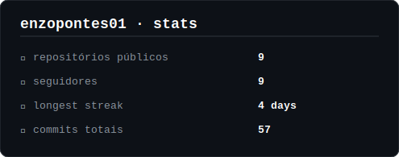

<!-- Banner -->
<div align="center">

```
███████╗███╗   ██╗███████╗ ██████╗
██╔════╝████╗  ██║╚══███╔╝██╔═══██╗
█████╗  ██╔██╗ ██║  ███╔╝ ██║   ██║
██╔══╝  ██║╚██╗██║ ███╔╝  ██║   ██║
███████╗██║ ╚████║███████╗╚██████╔╝
╚══════╝╚═╝  ╚═══╝╚══════╝ ╚═════╝
```

### `oi, eu sou o Enzo Pontes do Nascimento`

**Desenvolvedor em formação · Brasil Paraná · Gazin Tech**


</div>


<!-- Aprendendo atualmente -->
<div align="center">

## 📚 aprendendo atualmente


</div>

---

<!-- Pretendo aprender -->
<div align="center">

## 🚀 pretendo aprender


</div>

---

<!-- Ferramentas -->
<div align="center">

## 🛠️ ferramentas


</div>

---

<!-- Anime Chainsaw Man - Denji -->
<div align="center">

## ⛓️ chainsaw man

> *"I achieved my dream. So what now?"* — Denji

<table>
  <tr>
    <td align="center">
      
    </td>
    <td align="center">
      
    </td>
    <td align="center">
      
    </td>
  </tr>
</table>

</div>

---


<!-- GitHub Stats -->
<div align="center">

## 📊 estatísticas



</div>

---

<!-- Gráfico de Contribuições -->
<div align="center">

## 🖤 gráfico de contribuições

[](https://github.com/enzopontes01)

</div>

---

<div align="center">

*`// made with 🖤 by enzopontes01`*

</div>
